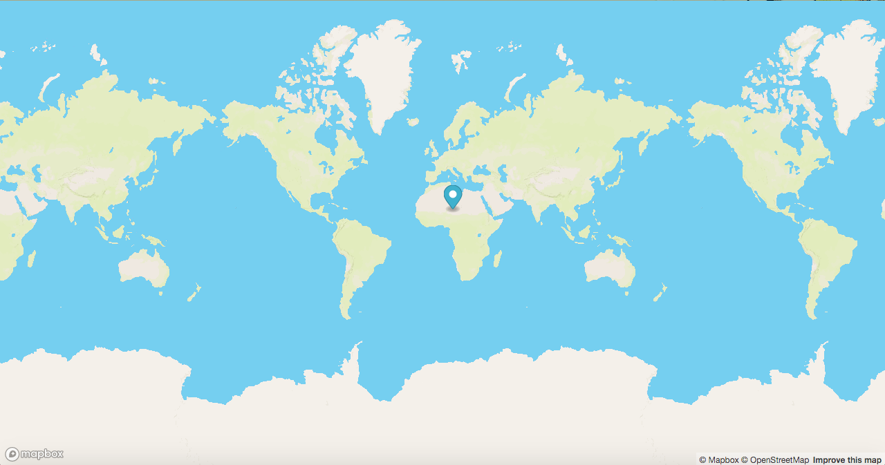

## My Submission 

Using mapbox and vexbot API I created a random point generator that refreshes when the page is refreshed.

Some features that could be included -
* Generate more points with a click of a button
* Make mark smaller and make a guessing game. 

How to use:
Get a mapbox API key, put it in the line where it states 'your-api-key-here' and load javascript/index.html!
